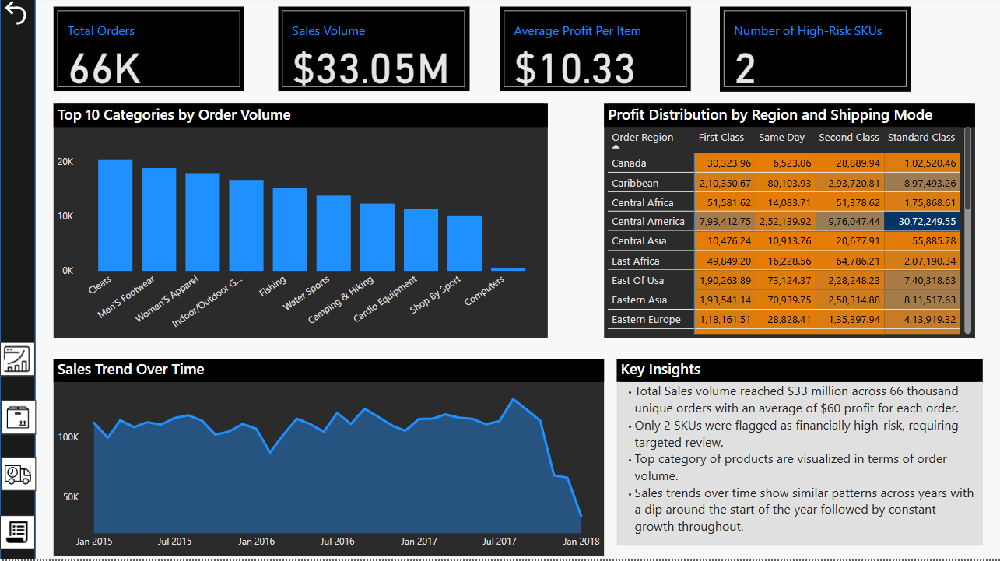
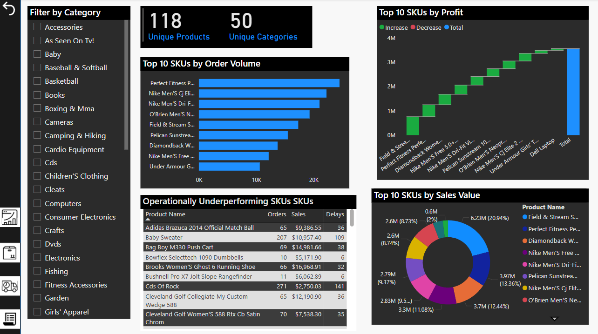
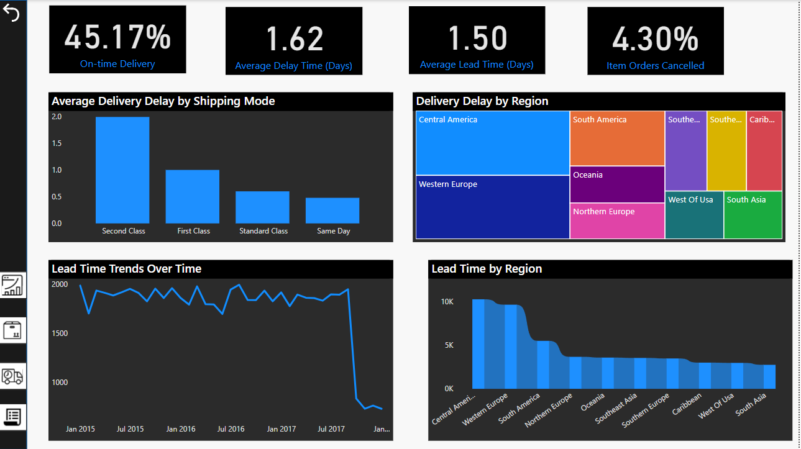
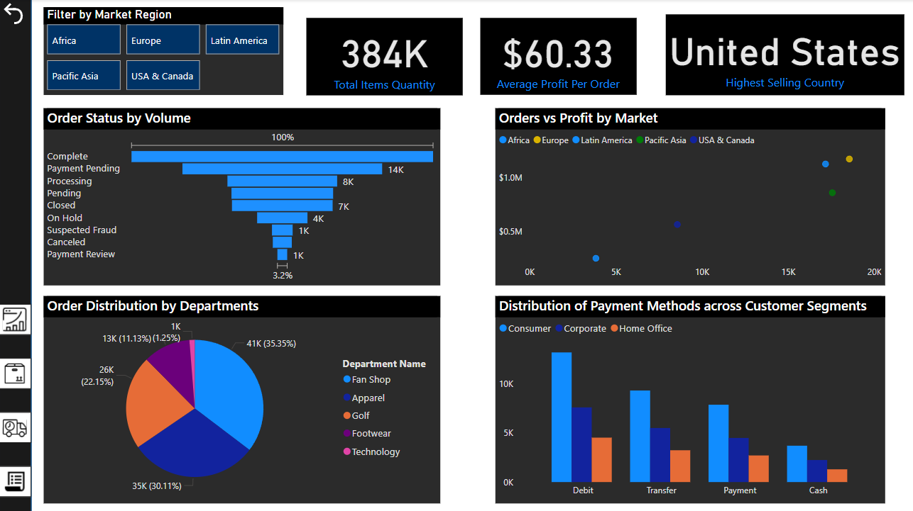

# Global Supply Chain Analytics Dashboard

Unlock actionable insights hidden within complex supply chain data with this end-to-end Power BI dashboard project.

## 📌 Project Overview

Modern supply chains generate massive volumes of data but fail to convert them into impactful decisions. This project bridges that gap by building a dynamic, executive-level dashboard analysing sales, product performance, delivery metrics, and order management across global markets.

## 💡 Problem Statement

Businesses often struggle to monitor end-to-end supply chain performance efficiently. Key challenges include:

- Lack of consolidated visibility into sales, profit, and logistics performance  
- Inability to pinpoint high-risk SKUs, delayed deliveries, or low-performing markets  
- Difficulty in executive-level reporting with interactive and intuitive visuals

This dashboard addresses these by providing targeted insights and streamlined visual storytelling.

## 🛠️ Tools & Technologies

- **Power BI Desktop**: Data cleaning, modelling, DAX measures, and visual design  
- **Excel**: Raw dataset source (DataCo Supply Chain dataset)  
- **DAX**: Custom measures for KPIs and advanced visuals

## 📊 Dashboard Structure

The dashboard comprises **four pages**, each with a specific analytical objective:

### 1. Executive Summary

_Key Focus_: Overall sales, profit, order quantity, and high-level supply chain KPIs.

**Screenshot:**  

---

### 2. Product Performance

_Key Focus_: Top performing SKUs, sales and profit distributions, and category-level breakdowns.

**Screenshot:**  

---

### 3. Delivery & Logistics

_Key Focus_: Delivery timelines, shipping modes analysis, and high-risk SKU identification.

**Screenshot:**  

---

### 4. Order Management

_Key Focus_: Order-level metrics such as payment type distribution, order volumes, and market-wise profit performance.

**Screenshot:**  

---

## ✅ Key Outcomes

- Developed a fully interactive, executive-level Power BI dashboard  
- Identified supply chain bottlenecks and high-risk items to guide targeted interventions  
- Designed intuitive visual layouts optimised for professional storytelling and stakeholder presentations

## 🚀 How to Use

1. Clone this repository  
2. Open `Global Supply Chain Analytics Dashboard.pbix` in **Power BI Desktop**  
3. Refresh data if required and explore the insights

## 📁 Dataset

- The dataset (`DataCoSupplyChainDataset.xlsx`) is included in the `datasets` folder.  
- Original dataset source: [DataCo Supply Chain dataset on Kaggle](https://www.kaggle.com/datasets) *(insert actual URL if public)*.

---

